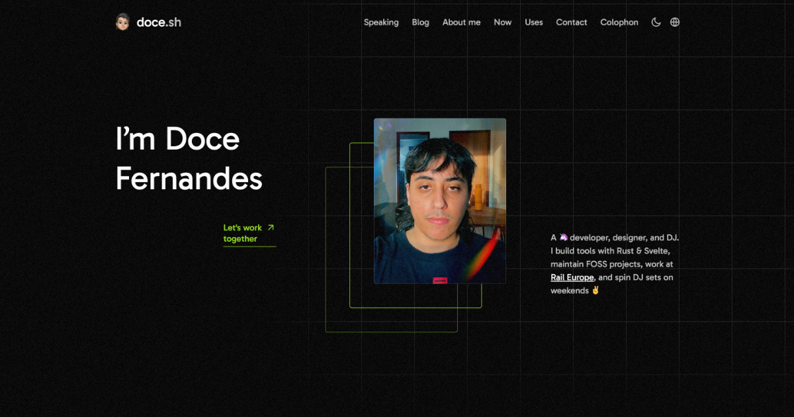

<h1 align="center">doceazedo.com</h1>

  This is my personal website and blog proudly made with <a href="https://svelte.dev" target="_blank">Svelte</a> and <a href="https://kit.svelte.dev" target="_blank">SvelteKit</a>, consuming posts from plain Markdown files and running on <a href="https://vercel.com" target="_blank">Vercel</a>.

  

  

## Deployments

| Environment  | URL                                             | Branch                                   |
|--------------|-------------------------------------------------|------------------------------------------|
| 🚀 Production | [doceazedo.com](https://doceazedo.com)         | Deploys on every commit to `main` branch |
| 🔮 Canary     | [pbe.doceazedo.com](https://pbe.doceazedo.com) | Deploys on every commit to `pbe` branch  |

## Hold up! ✋

**Note:** This website was not created to be used as a template or theme, but for my personal use. Feel free to borrow any piece of code or draw inspiration from it, but don't expect it to work by just cloning and deploying it.
